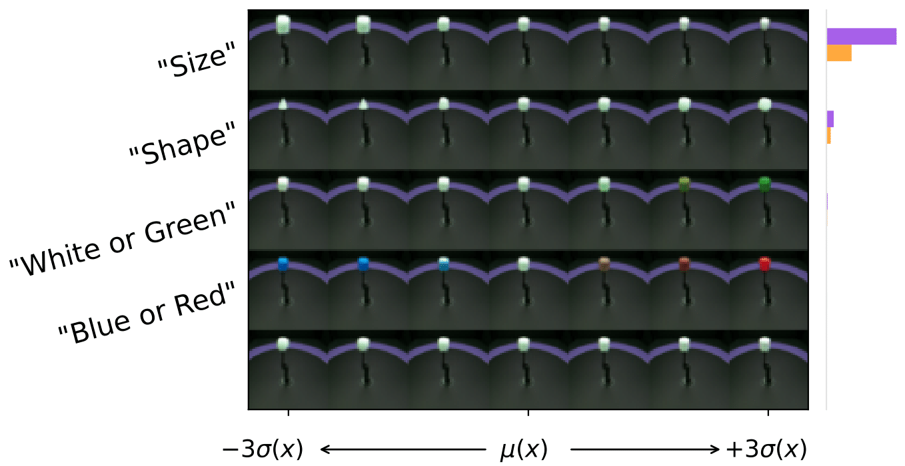
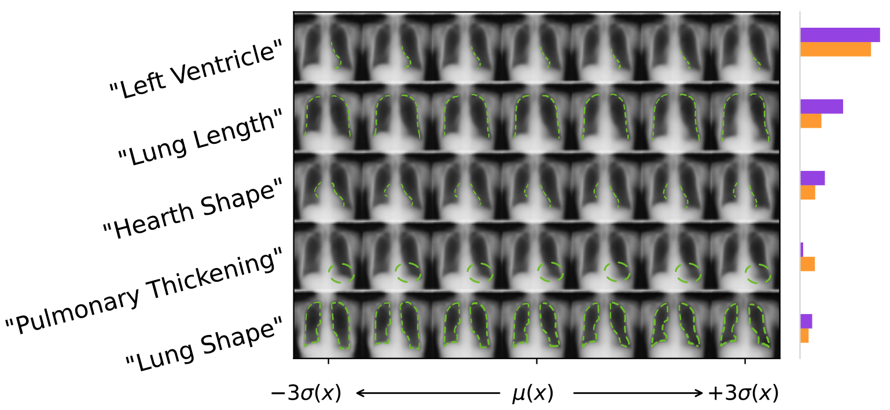

# CLAP Interpretable Predictions 👏🏻
Official codebase for the paper (link to preprint) <br />
"Provable concept learning for interpretable predictions using variational inference", <br /> 
_Taeb A., Ruggeri N., Schnuck C., Yang F._ 

_CLAP_ on the MPI Dataset             |  _CLAP_ on the ChestXRay Dataset
:-------------------------:|:-------------------------:
 | 

### Code usage
To start training _CLAP_ on a dataset:

- download the desired dataset and place it in the `./data` directory. 
Alternatively, change the default data directory specified at `src.data.utils.DATA_DIR`
- run the terminal command. The datasets available are 
`MPI`, `Shapes3D`, `SmallNORB`, `ChestXRay`, `PlantVillage`. 

For example, to train _CLAP_ on the `MPI3D` dataset, the terminal command is
```python
python main.py --dataset MPI
```
More options for training, e.g. latent space dimension and regularization parameters, are specified inside `main.py`.


